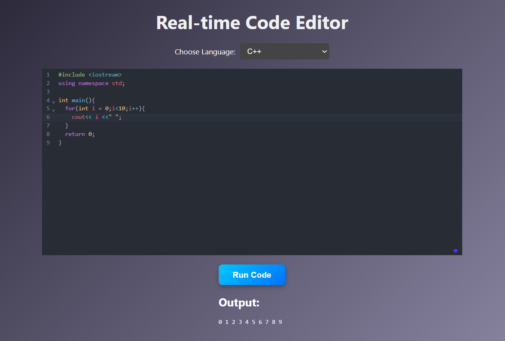

# 🧑‍💻 CodeCollab - Real-Time Code Editor

CodeCollab is a real-time, browser-based code editor that allows users to **write, run, and view output of code instantly** in multiple programming languages — all from the comfort of a sleek web UI.

Built using **React.js** for the frontend, **Node.js** for the backend, and powered by the [Piston API](https://github.com/engineer-man/piston) for secure code execution.

---

## 🚀 Features

- ✅ Supports multiple programming languages (C++, Python, Java, etc.)
- ✅ Write code directly in the browser
- ✅ Execute code and view output or errors in real-time
- ✅ Backend integration with REST API
- ✅ React + Express full-stack application

---

## 🛠️ Tech Stack

| Tech        | Role            |
|-------------|-----------------|
| React.js    | Frontend UI     |
| Node.js     | Backend server  |
| Express.js  | API integration |
| Piston API  | Code execution  |
| HTML/CSS    | Styling         |

---

## 📷 Screenshot



---

## ⚙️ Getting Started

### 1. Clone the repository

```bash
git clone https://github.com/MajjiBindu/code-collab.git
cd code-collab
